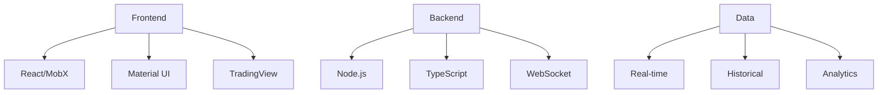
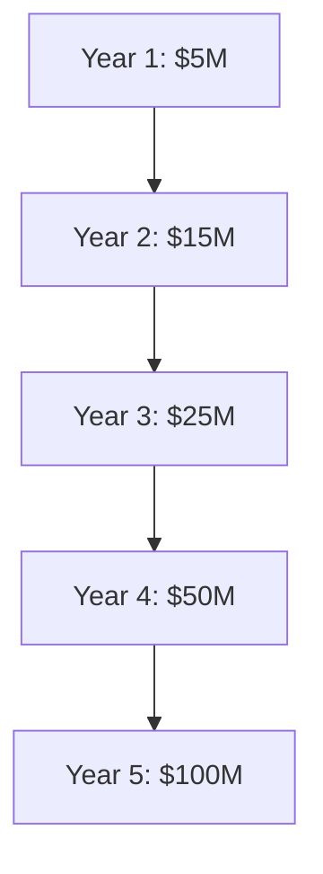

# Algo360FX
## Next-Generation Forex Trading Platform
### Investor Presentation - 2024

---

## Executive Summary

### Revolutionary Trading Platform
- Enterprise-grade forex trading solution
- Advanced AI/ML capabilities
- Complete trading ecosystem
- Professional-grade tools

### Market Opportunity
- $6.6T daily forex market
- Growing retail participation
- Demand for advanced tools
- Enterprise solutions needed

### Investment Highlights
- Cutting-edge technology
- Multiple revenue streams
- Scalable architecture
- Strong competitive advantages

---

## Market Problem

### Current Market Challenges
1. **Limited Tools**
   - Basic platforms
   - Poor user experience
   - Limited analytics
   - Fragmented solutions

2. **Technology Gap**
   - Outdated systems
   - Poor performance
   - Limited automation
   - Lack of innovation

3. **Professional Needs**
   - Enterprise requirements
   - Risk management
   - Portfolio analytics
   - Compliance tools

---

## Our Solution

### Complete Trading Ecosystem
- Professional trading interface
- Advanced analytics
- Risk management
- Portfolio optimization

### Technology Excellence
- High-performance architecture
- Real-time processing
- AI/ML integration
- Cloud scalability

### Professional Tools
- Strategy builder
- Money manager portal
- Signal provider system
- Institutional features

---

## Platform Features

### 1. Trading Interface

- Advanced charting
- One-click trading
- Real-time data
- Risk controls

### 2. Strategy Builder

- Visual editor
- Backtesting
- Optimization
- Templates

### 3. Portfolio Analytics

- Performance metrics
- Risk analysis
- Asset allocation
- Historical data

---

## Professional Features

### 1. Money Manager Portal

- Multi-account management
- Risk controls
- Client reporting
- Performance tracking

### 2. Signal Provider System

- Strategy marketplace
- Performance metrics
- Subscriber management
- Revenue sharing

### 3. Institutional Tools

- API integration
- Custom solutions
- Advanced reporting
- Compliance features

---

## Technology Stack

### Architecture

### Key Components
- High-performance trading engine
- Real-time data processing
- Advanced analytics system
- Machine learning integration

---

## Market Comparison

### Platform Comparison
| Feature | Algo360FX | MT4/MT5 | cTrader | Custom |
|---------|-----------|---------|----------|---------|
| Modern UI | ✓ | ✗ | ✓ | Varies |
| AI/ML | ✓ | ✗ | ✗ | Limited |
| Professional Tools | ✓ | Limited | Limited | Varies |
| Education | ✓ | ✗ | Limited | ✗ |
| Enterprise | ✓ | Limited | ✗ | ✓ |
| Mobile | ✓ | Limited | ✓ | Varies |

### Our Advantages
1. Complete ecosystem
2. Advanced technology
3. Professional tools
4. Educational platform

---

## Business Model

### Revenue Streams

1. **Subscriptions**
   - Basic: $29/month
   - Advanced: $99/month
   - Professional: $299/month
   - Enterprise: Custom

2. **Trading Revenue**
   - Commission per trade
   - Spread revenue share
   - Signal provider fees
   - Strategy marketplace

3. **Enterprise Solutions**
   - White label platform
   - Custom integration
   - Professional services
   - Support packages

---

## Market Size & Opportunity

### Global Forex Market
- Daily volume: $6.6T
- Retail traders: 15%
- Professional: 25%
- Institutional: 60%

### Target Market
- Retail: $500B daily
- Professional: $1.2T daily
- Institutional: $4.9T daily

### Growth Potential
- Market growth: 7.5% annually
- Retail growth: 12% annually
- Technology adoption: 25% annually
- Automation trend: 35% annually

---

## Financial Projections

### 5-Year Forecast

### Key Metrics
- User growth: 100% annually
- Revenue per user: $1,200
- Gross margin: 75%
- Operating margin: 35%

---

## Investment Opportunity

### Funding Need
- Series A: $10M
- Valuation: $50M
- Use of funds:
  - Technology: 40%
  - Marketing: 30%
  - Operations: 20%
  - Reserve: 10%

### Investment Terms
- Equity offering
- Board representation
- Strategic partnership
- Growth capital

---

## Growth Strategy

### 1. Market Expansion

- Geographic expansion
- Product development
- Market penetration
- Partnership growth

### 2. Technology Development

- AI/ML enhancement
- Feature expansion
- Mobile development
- Enterprise solutions

### 3. Business Development

- Strategic partnerships
- Institutional clients
- White label solutions
- Educational programs

---

## Demo Scenarios

### Scenario 1: Retail Trading
1. Open trading interface
2. Analyze market
3. Place trades
4. Manage positions
5. Track performance

### Scenario 2: Professional Tools
1. Create trading strategy
2. Backtest performance
3. Optimize parameters
4. Deploy automation
5. Monitor results

### Scenario 3: Enterprise Features
1. Multi-account management
2. Risk analysis
3. Client reporting
4. Performance tracking
5. Compliance tools

---

## Team & Advisory Board

### Management Team
- CEO: [Name] - 15 years fintech
- CTO: [Name] - 12 years trading systems
- CPO: [Name] - 10 years product
- CFO: [Name] - 20 years finance

### Advisory Board
- Trading experts
- Technology veterans
- Industry leaders
- Financial advisors

---

## Next Steps

### 1. Investment Process
- Due diligence
- Term sheet
- Documentation
- Closing

### 2. Growth Plan
- Technology development
- Market expansion
- Team growth
- Revenue scaling

### 3. Partnership Opportunities
- Strategic collaboration
- Market access
- Technology integration
- Revenue sharing

---

## Contact Information

### Get In Touch
- Email: [contact@algo360fx.com]
- Website: [www.algo360fx.com]
- Phone: [+1-XXX-XXX-XXXX]
- Location: [Address]

### Follow Up
- Technical deep dive
- Financial review
- Customer testimonials
- Site visit

---

*This presentation is confidential and intended for qualified investors only.*
