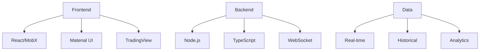
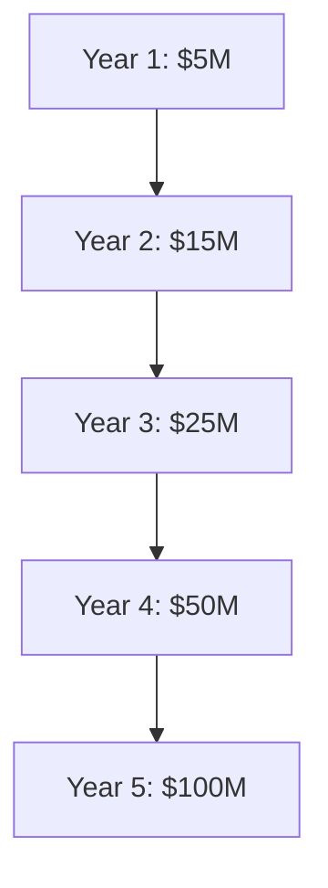

# Algo360FX
Next-Generation Forex Trading Platform

  
    Press Space for next page <carbon:arrow-right class="inline"/>
  

---
layout: image-right
image: /App%20Screenshots/Screenshot%202024-12-24%20222035.png
---

# Executive Summary

- Enterprise-grade forex trading solution
- Advanced AI/ML capabilities
- Complete trading ecosystem
- Professional-grade tools

Market Opportunity:
- $6.6T daily forex market
- Growing retail participation
- Demand for advanced tools
- Enterprise solutions needed

---
layout: default
---

# Market Problem

## Current Market Challenges

1. Limited Tools
   - Basic platforms
   - Poor user experience
   - Limited analytics
   - Fragmented solutions

2. Technology Gap
   - Outdated systems
   - Poor performance
   - Limited automation
   - Lack of innovation

3. Professional Needs
   - Enterprise requirements
   - Risk management
   - Portfolio analytics
   - Compliance tools

---
layout: image-right
image: /App%20Screenshots/Screenshot%202024-12-24%20222123.png
---

# Our Solution

## Complete Trading Ecosystem

- Professional trading interface
- Advanced analytics
- Risk management
- Portfolio optimization

## Technology Excellence

- High-performance architecture
- Real-time processing
- AI/ML integration
- Cloud scalability

---
layout: two-cols
---

# Platform Features

::right::

## Key Components

1. Trading Interface
   - Advanced charting
   - One-click trading
   - Real-time data
   - Risk controls

2. Strategy Builder
   - Visual editor
   - Backtesting
   - Optimization
   - Templates

---
layout: image-right
image: /App%20Screenshots/Screenshot%202024-12-24%20222238.png
---

# Professional Features

1. Money Manager Portal
   - Multi-account management
   - Risk controls
   - Client reporting
   - Performance tracking

2. Signal Provider System
   - Strategy marketplace
   - Performance metrics
   - Subscriber management
   - Revenue sharing

---
layout: center
class: text-center
---

# Technology Stack

---
layout: default
---

# Market Comparison

| Feature | Algo360FX | MT4/MT5 | cTrader | Custom |
|---------|-----------|---------|----------|---------|
| Modern UI | ✓ | ✗ | ✓ | Varies |
| AI/ML | ✓ | ✗ | ✗ | Limited |
| Professional Tools | ✓ | Limited | Limited | Varies |
| Education | ✓ | ✗ | Limited | ✗ |
| Enterprise | ✓ | Limited | ✗ | ✓ |
| Mobile | ✓ | Limited | ✓ | Varies |

---
layout: image-right
image: /App%20Screenshots/Screenshot%202024-12-24%20222658.png
---

# Business Model

## Revenue Streams

1. Subscriptions
   - Basic: $29/month
   - Advanced: $99/month
   - Professional: $299/month
   - Enterprise: Custom

2. Trading Revenue
   - Commission per trade
   - Spread revenue share
   - Signal provider fees
   - Strategy marketplace

---
layout: center
---

# Market Size & Opportunity

## Global Forex Market

- Daily volume: $6.6T
- Retail traders: 15%
- Professional: 25%
- Institutional: 60%

## Growth Potential

- Market growth: 7.5% annually
- Retail growth: 12% annually
- Technology adoption: 25% annually
- Automation trend: 35% annually

---
layout: center
class: text-center
---

# Financial Projections

---
layout: default
---

# Investment Opportunity

## Funding Need
- Series A: $10M
- Valuation: $50M

## Use of Funds
- Technology: 40%
- Marketing: 30%
- Operations: 20%
- Reserve: 10%

---
layout: two-cols
---

# Growth Strategy

::right::

1. Market Expansion
   - Geographic expansion
   - Product development
   - Market penetration
   - Partnership growth

2. Technology Development
   - AI/ML enhancement
   - Feature expansion
   - Mobile development
   - Enterprise solutions

---
layout: center
class: text-center
---

# Thank You

Contact Information:
- Email: contact@algo360fx.com
- Website: www.algo360fx.com
- Phone: +1-XXX-XXX-XXXX

  
    This presentation is confidential and intended for qualified investors only.
  

